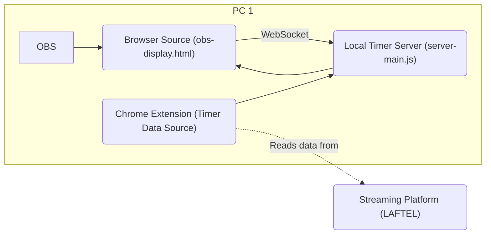
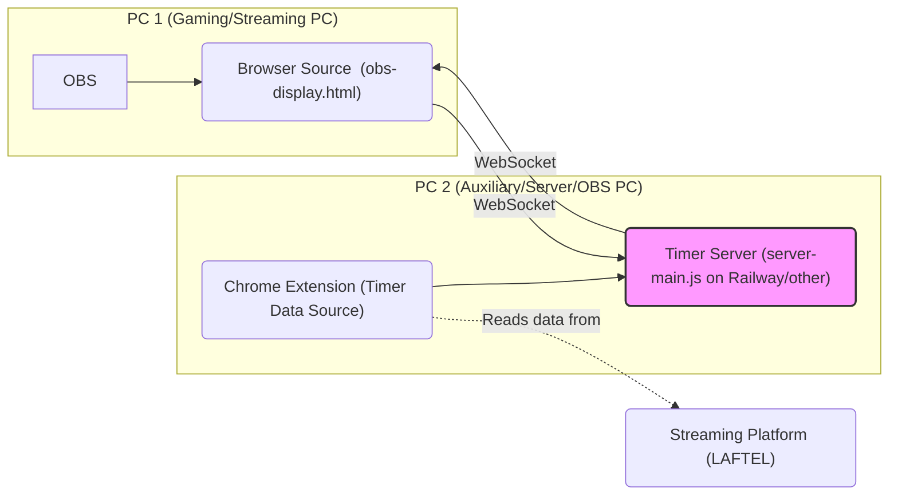
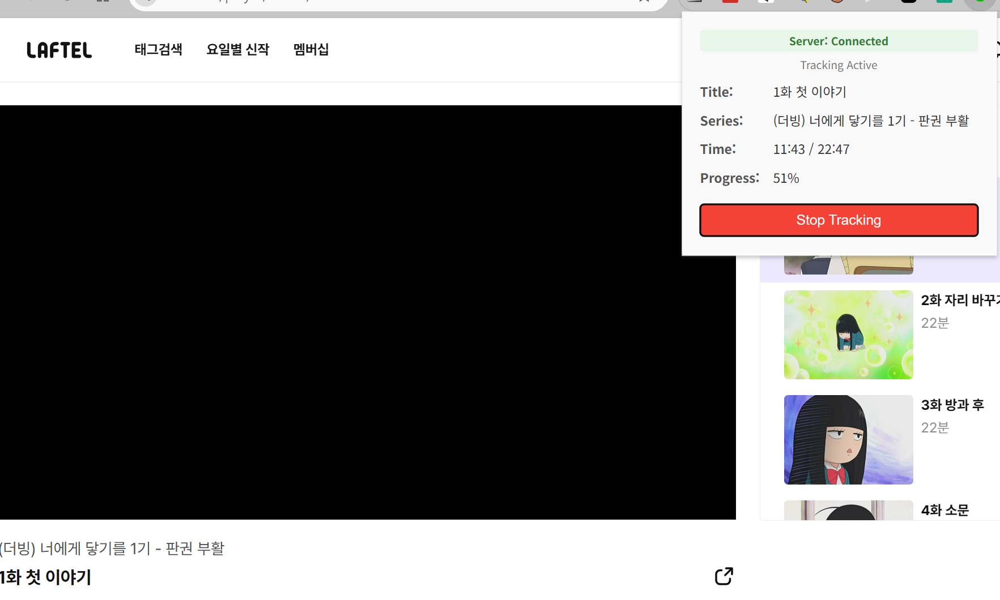
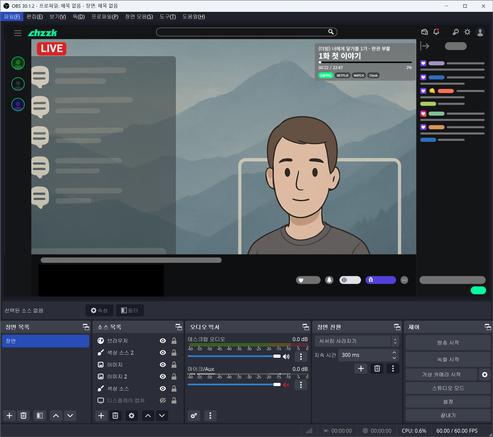

# Watch Party OBS Timer (한국어)

[View English Version](./README.en.md)

이 프로젝트는 스트리밍 서비스(초기에는 Laftel을 지원하며, 향후 확장 계획이 있습니다)의 비디오 재생 정보(제목, 부제목, 현재 시간, 총 재생 시간)를 OBS Studio에 직접 표시하여, 동기화된 단체 시청(watch party) 경험을 향상시키거나 개인 스트리밍 중 현재 시청 중인 콘텐츠를 실시간으로 보여주는 데 이상적입니다.

두 가지 주요 구성 요소로 이루어져 있습니다:

1.  **크롬 확장 프로그램 (`watch-party-extension/`)**: 스트리밍 서비스의 웹 플레이어에서 재생 정보를 추출합니다.
    *   [확장 프로그램 상세 README (영문)](./watch-party-extension/README.md)
2.  **Node.js 서버 (`obs-timer-server/`)**: 확장 프로그램으로부터 데이터를 수신하고, OBS에 타이머 및 비디오 상세 정보를 표시하기 위한 사용자 설정 가능한 HTML 오버레이를 제공합니다.
    *   [서버 상세 README (영문)](./obs-timer-server/README.md)

## 주요 기능 (버전 1.0)

*   단일 사용자 환경을 기준으로, OBS에서 비디오 제목, 부제목(시리즈/에피소드), 현재 재생 시간, 총 재생 시간 실시간 표시.
*   브라우저 확장 프로그램과 로컬 Node.js 서버 간 웹소켓을 통한 원활한 통신.
*   서버에서 제공하는 웹 인터페이스를 통해 OBS 오버레이 표시 옵션(예: 색상, 글꼴 크기) 설정 가능.
*   원컴 스트리밍 환경에 최적화되어 있으며, 투컴 스트리밍 환경의 경우 (예: 한 PC에서 로컬 서버 실행 시) 수동으로 서버 IP 주소 설정이 필요할 수 있습니다.
*   초기 Laftel 지원, 향후 더 많은 플랫폼을 지원하는 것을 목표로 유연하게 설계.

## 아키텍처

### Single-Computer Setup

### Dual-Computer Setup

## 기술 스택

*   **크롬 확장 프로그램**: JavaScript, HTML, CSS, Chrome Extension API, WebSockets
*   **Node.js 서버**: Node.js, Express.js (또는 네이티브 http 모듈), WebSocket (예: `ws` 라이브러리)
*   **OBS 표시 화면**: HTML, CSS, JavaScript (클라이언트 측 WebSocket)

## 스크린샷

확장 프로그램 및 OBS 오버레이 작동 모습 예시입니다:

**크롬 확장 프로그램 작동 모습:**

**OBS 오버레이 화면:**

## 설치 및 사용법 (v1.0)

### 1. 일반 사용자

워치 파티나 스트리밍에 타이머를 사용하고 싶다면:

*   **서버 애플리케이션 (v1.0 - 소스 코드로 실행)**:
    *   현재 v1.0에서는 소스 코드를 직접 실행하는 방식이 주된 사용법입니다. 이를 위해서는 Node.js 설치가 필요합니다.
    *   아래 "2. 개발자 (또는 소스 코드에서 직접 실행하고 싶은 경우)" 섹션의 안내에 따라 서버를 설정하고 실행해주세요.
    *   (더 간편한 설치를 위한 사전 빌드된 실행 파일은 향후 릴리즈에 포함될 예정입니다.)
*   **크롬 확장 프로그램**:
    *   크롬 확장 프로그램을 설치합니다. `.crx` 파일 형태로 제공되거나, `watch-party-extension` 디렉토리에서 압축 해제된 확장 프로그램을 로드하여 사용할 수 있습니다. (릴리즈 섹션 확인)
    *   [확장 프로그램 README의 "설치 및 사용법" 섹션 (영문)](./watch-party-extension/README.md#setup-and-usage)을 따릅니다.
*   **OBS 설정**: 서버 표시 페이지(예: 서버와 동일한 PC에서 실행 중인 경우 `http://localhost:3000`)를 OBS Studio의 브라우저 소스로 추가합니다.

### 2. 개발자 (또는 소스 코드에서 직접 실행하고 싶은 경우)

코드를 수정하거나, 기여하거나, Node.js를 사용하여 서버를 직접 실행하고 싶다면:

*   **사전 준비물**:
    *   Node.js (LTS 버전 권장, 예: v18 이상. 필요한 경우 `obs-timer-server/package.json`의 engine 요구사항 확인)
    *   Git (저장소 복제용)
*   **설정**:
    1.  이 저장소를 복제합니다: `git clone https://github.com/june-oh/obs-watch-party.git`
    2.  `obs-timer-server` 디렉토리로 이동하여 의존성을 설치합니다: `cd obs-timer-server && npm install` (또는 Yarn 사용 시 `yarn install`)
    3.  [서버 README (영문)](./obs-timer-server/README.md#setup-and-usage)의 서버 설정 안내를 따릅니다.
    4.  확장 프로그램의 경우, [확장 프로그램 README (영문)](./watch-party-extension/README.md#setup-and-usage)에 설명된 대로 `watch-party-extension` 디렉토리에서 압축 해제된 확장 프로그램으로 로드합니다.
*   **실행**:
    *   Node.js 서버를 시작합니다: `cd obs-timer-server && node src/server-main.js` (또는 해당 README에 명시된 대로).
    *   브라우저에서 크롬 확장 프로그램이 활성화되어 있는지 확인합니다.
*   **빌드 (선택 사항)**: 서버 코드를 변경하고 실행 파일을 만들고 싶다면, [서버 README (영문)](./obs-timer-server/README.md#packaging-executable)의 빌드 안내를 따릅니다.

## 향후 계획

*   추가 스트리밍 플랫폼 지원 (예: Netflix, YouTube, Disney+).
*   OBS 오버레이를 위한 향상된 사용자 정의 옵션.
*   클라우드 호스팅 서버를 이용한 다중 사용자 환경 지원 (사용자/스트리머별 개별 타이머).
*   더 쉽고 안정적인 투컴/다중 사용자 설정을 위한 클라우드 기반 서버 호스팅(예: Railway, Render) 옵션 제공.
*   확장 프로그램을 위한 더 사용자 친화적인 설정 관리 (예: 옵션 페이지를 통해).
*   다른 언어 지원 (현지화).

## 기여하기

기여를 환영합니다! 자세한 기여 방법(브랜칭 전략, 커밋 규약, 버전 관리 포함)은 [기여 가이드라인 (영문)](./CONTRIBUTING.md)을 참고해주세요.

새로운 기능, 개선 사항 또는 버그 수정에 대한 아이디어가 있다면 언제든지 다음을 수행해 주세요:

1.  아이디어를 논의하기 위해 이슈를 개설합니다.
2.  저장소를 포크하고 변경 사항에 대한 풀 리퀘스트를 제출합니다.

기존 코딩 스타일을 따르고 변경 사항이 잘 테스트되었는지 확인해 주시기 바랍니다.

## 라이선스

이 프로젝트는 MIT 라이선스를 따릅니다 - 자세한 내용은 [LICENSE](./LICENSE) 파일을 참고하세요. 
